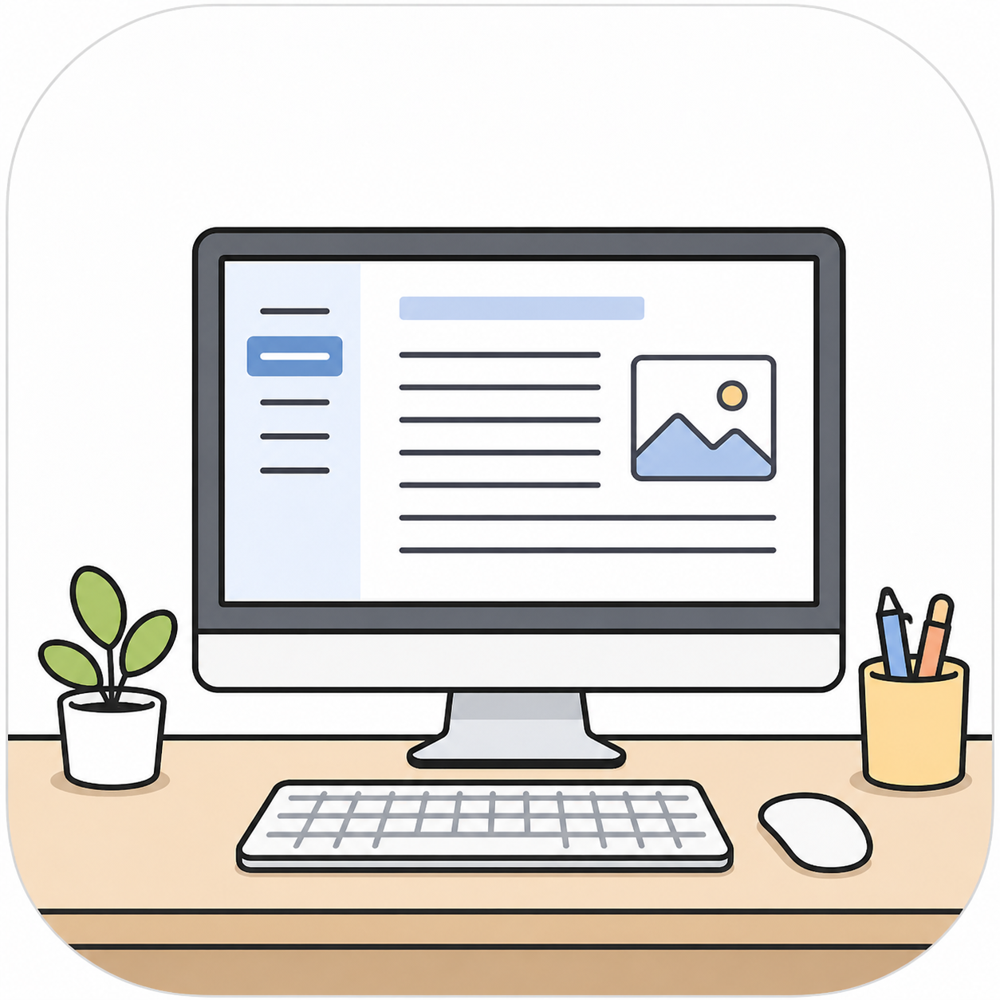

<div align="center">
  
</div>

# Paper a Day, Doctor One Step Away

> ### 🌐 [paper-a-day-doctor-one-step-away.vercel.app](https://paper-a-day-doctor-one-step-away.vercel.app)
>
> Just open the link. Pick a handle and a 6+ character key. Choose your
> arXiv categories. That's it — your feed is ready and lives across devices
> as long as you remember those two strings.

A Rednote/Xiaohongshu-style feed for arXiv papers. Open the app, scroll a
masonry grid of papers in your research area, tap any card to read the
abstract, save the ones you love. The feed learns from your behavior and
gets sharper over time.

> **Heads up:** I built this for myself to make reading papers feel less
> like a chore and more like the kind of infinite scroll I already do on
> social media. The hosted version above is free for anyone to use — no
> email, no password, no signup. If you'd rather host your own copy
> (full control over data + algorithm), see [Self-host](#self-host) at the
> bottom.

## Why this exists

I wanted to read more papers but kept hitting the same problems:

- The arXiv firehose is overwhelming — hundreds of new papers daily in any
  given subfield.
- Aggregator sites push popular papers, not necessarily papers in *my*
  niche.
- I love how Rednote can show me five interesting
  things in a row without me having to search. Why doesn't that exist for
  research?
- I don't want to pay anyone — papers I care about are already free on
  arXiv.

So this is that app, on my phone, for free.

## How to use it (the hosted version)

1. Open [paper-a-day-doctor-one-step-away.vercel.app](https://paper-a-day-doctor-one-step-away.vercel.app).
2. **Start fresh** — pick a handle (e.g. `your-name`) and a 6+ character
   key. **Save them somewhere safe.** No email recovery — they're your
   only way back in.
3. Pick the arXiv categories you want to follow.
4. (Optional) Paste 3–5 arXiv IDs of papers you've found valuable to seed
   your taste vector right away.
5. New papers arrive automatically every morning at 6 AM PT.

**On another device:** open the same URL, click "I already have a handle,"
type your handle and key. Your feed and history come back instantly.

**Save it as an app on your phone:**
- iOS Safari → Share → Add to Home Screen
- Android Chrome → menu → Install app

It launches full-screen from the icon, no browser chrome.

## How to use the feed

- **Scroll the grid.** Each card is a paper.
- **Tap a card** → full abstract, with **Save** and **Read PDF** buttons.
- **That's it.** No swipe-yes/swipe-no rating, no thumbs up/down. Every
  scroll, pause, tap, save, and PDF-open is a signal — the algorithm builds
  your taste vector from your natural behavior.

## How the algorithm works

Three layers, each pulling its weight:

| Layer | Mechanism | Why |
|---|---|---|
| **Topic selection** | Thompson Sampling on Beta(α, β) per arXiv category. α grows with positive interactions, β with skipped impressions. | Balances explore vs. exploit at the topic level — categories you've never tried still get a fair shot, categories you love get more slots. |
| **Paper ranking** | Cosine similarity between each paper's embedding and your evolving profile vector. | Within a chosen category, surface papers closest to your tastes. |
| **Profile drift** | Exponential moving average of paper embeddings, weighted by signal strength (PDF open > save > long view > tap > dwell). | Your taste vector shifts gradually toward what you actually engage with, with noisy signals fading naturally over time. |

A small fraction of feed slots (configurable, default 15%) are filled with
random papers from your categories — the anti-echo-chamber knob.

## Privacy and security

- **No email, no password recovery.** Anyone who knows your handle + key
  can read your feed history. Pick a key you don't use elsewhere.
- **Your data is in my Supabase project** — I can technically see it if I
  go looking. I won't, but if that bothers you, [self-host](#self-host).
- **Categories are global.** When anyone signs up with a new arXiv
  category, tomorrow's cron starts pulling papers in that category for
  *everyone* — papers themselves are shared across users, only your
  preferences and interactions are private to your handle.

---

## Self-host

For full control over your data and the algorithm. Total cost: **$0/month**
on free tiers.

### 1. Supabase

1. Sign up at [supabase.com](https://supabase.com), create a new project.
2. SQL Editor → paste all of [`supabase-setup.sql`](supabase-setup.sql) → Run.
3. Settings → API → grab three values:
   - `Project URL` → `NEXT_PUBLIC_SUPABASE_URL`
   - `anon public` → `NEXT_PUBLIC_SUPABASE_ANON_KEY`
   - `service_role` → `SUPABASE_SERVICE_ROLE_KEY` (server-only — secret)

### 2. Hugging Face

1. Sign up at [huggingface.co](https://huggingface.co).
2. Settings → Access Tokens → New token (read scope) → save as `HUGGINGFACE_API_KEY`.

### 3. Local dev

```bash
cp .env.local.example .env.local
# fill in the 5 values

npm install
npm run dev
```

Visit `http://localhost:3000`. You'll see the welcome screen — claim a
handle. After onboarding, trigger ingestion manually so you have papers
right away (instead of waiting for tomorrow's cron):

```bash
curl -X POST http://localhost:3000/api/cron/ingest \
  -H "Authorization: Bearer $CRON_SECRET"
```

### 4. Deploy to Vercel

1. Push to your fork on GitHub.
2. Vercel → **Add New Project** → import the repo.
3. Add the same five env vars under **Settings → Environment Variables**.
4. Deploy. Vercel reads `vercel.json` and schedules the daily cron at
   13:00 UTC automatically (change the schedule there if you want).

### 5. Phone install

1. Drop `icon-192.png` and `icon-512.png` into `public/` (any square PNG).
2. Open `your-app.vercel.app` on your phone → Add to Home Screen.

### Already ran the old single-user schema?

If you ran an older version of `supabase-setup.sql` (single-user), use
[`supabase-migrate-multiuser.sql`](supabase-migrate-multiuser.sql) instead
to migrate to the new shape. It drops the old tables and recreates them.

## Tweaking the algorithm

| What | Where |
|---|---|
| Reward weights per event type | `lib/types.ts` → `REWARD_WEIGHTS` |
| Profile-vector learning rate | `lib/types.ts` → `PROFILE_LR` |
| Exploration rate | onboarding form, or `user_preferences` row |
| Daily feed size | onboarding form |
| Available categories | `app/onboarding/page.tsx` → `CATEGORY_GROUPS` |
| Cron schedule | `vercel.json` |

Full arXiv taxonomy: [arxiv.org/category_taxonomy](https://arxiv.org/category_taxonomy).

## Tech stack

| Service | What it does | Free tier headroom |
|---|---|---|
| Vercel | Frontend + serverless functions + cron | Generous |
| Supabase | Postgres + pgvector | 500 MB |
| Hugging Face | Embeddings (`all-MiniLM-L6-v2`, 384-dim) | More than enough — papers are global, so cost doesn't scale with users |
| arXiv | Paper metadata + PDFs | Free |

## Future ideas

Ordered roughly by want vs. effort:

- **LLM-generated TL;DRs** — call Gemini 1.5 Flash (free tier) during the
  daily ingest to turn each abstract into 2–3 short bullets.
- **Saved library page** — `/library` with all saved papers, search, and
  date/category grouping.
- **Better cold start** — paste a research statement / abstract of your
  own thesis as the seed instead of arXiv IDs.
- **Multi-source ingestion** — Semantic Scholar, bioRxiv, medRxiv, OpenReview.
- **Citation-graph features** — "papers similar to this one" via
  co-citation on Semantic Scholar.
- **Cover images** — extract the first figure from each PDF as a thumbnail.
- **Email/push digest** — a weekly summary of "papers you most engaged with."
- **Zotero / Notion export** — saved papers go straight to your reference manager.
- **Reading streaks** — gentle gamification for keeping the daily habit.
- **Taste-vector visualization** — t-SNE plot of how your profile vector
  has drifted over weeks.
- **Audio summaries** — TTS for commute listening.
- **Better RL** — once there's enough data, replace the per-category
  Thompson Sampler with a contextual bandit conditioning on time of day,
  recent reading history, etc.

## Files of interest

| File | Purpose |
|---|---|
| `lib/recommender.ts` | Builds the daily feed (bandit + similarity + exploration) |
| `lib/bandit.ts` | Thompson Sampling on Beta distributions |
| `lib/embeddings.ts` | Hugging Face embedding calls + EMA helper |
| `lib/auth.ts` | Handle/key validation + hashing + per-request guard |
| `lib/arxiv.ts` | arXiv API + XML parsing |
| `app/api/cron/ingest/route.ts` | Daily paper ingestion (uses union of all users' categories) |
| `app/api/interactions/route.ts` | Records events, updates per-user bandit + profile |
| `app/api/feed/route.ts` | Returns today's personalized feed for the signed-in user |
| `app/login/page.tsx` | Welcome / claim / sign-in flows |
| `components/Feed.tsx` | Masonry grid + IntersectionObserver |
| `components/Card.tsx` | Single paper card |
| `components/DetailModal.tsx` | Tap-to-open detail view |
| `supabase-setup.sql` | All schema in one runnable file |

## License

MIT — do whatever you like, no warranty.
